# End-to-End Data Engineering Pipeline with Airflow, dbt & Snowflake

**Author:** Yizuo Deng

A production-inspired Data Engineering project that demonstrates how to build an automated analytics pipeline using **Python**, **Snowflake**, **dbt**, **Apache Airflow**, **Docker**, and **GitHub Actions**.

## Key Features

- End-to-end ELT pipeline from raw CSV files to analytics-ready data marts
- Automated workflow orchestration with Apache Airflow
- Layered data transformations using dbt (staging, intermediate, marts)
- Cloud data warehouse built on Snowflake
- Automated data quality testing with dbt tests
- Dockerized development environment for reproducible deployments
- Continuous Integration (CI) using GitHub Actions
- Secure credential management using GitHub Secrets

The project simulates a real business scenario where daily operational data from multiple regions is automatically ingested, transformed, tested, and prepared for business analytics.

---

## Project Overview

Modern data platforms require more than writing SQL—they require reliable orchestration, automated testing, reproducible environments, and continuous integration.

This project demonstrates an end-to-end analytics pipeline that:

- Generates daily operational data
- Loads raw data into Snowflake
- Builds layered data models using dbt
- Validates data quality with dbt tests
- Orchestrates the workflow with Apache Airflow
- Runs inside Docker containers
- Automatically validates every code change using GitHub Actions

The project follows modern Data Engineering best practices and mirrors the architecture commonly used in production environments.

---

# Business Scenario

A fictional global retail company receives daily operational reports from four regions.

The reports contain regional sales performance, customer growth, operational metrics, marketing costs, and retention statistics.

Instead of manually processing Excel files every day, the company wants an automated pipeline that can:

- ingest raw operational data
- store raw data in a cloud data warehouse
- clean and transform the data
- build analytics-ready tables
- automatically test data quality
- orchestrate scheduled workflows
- validate every code change before deployment

This project implements that complete workflow.

---

# Architecture

The project combines a layered analytics pipeline with workflow orchestration, containerized runtime services, and automated CI validation.

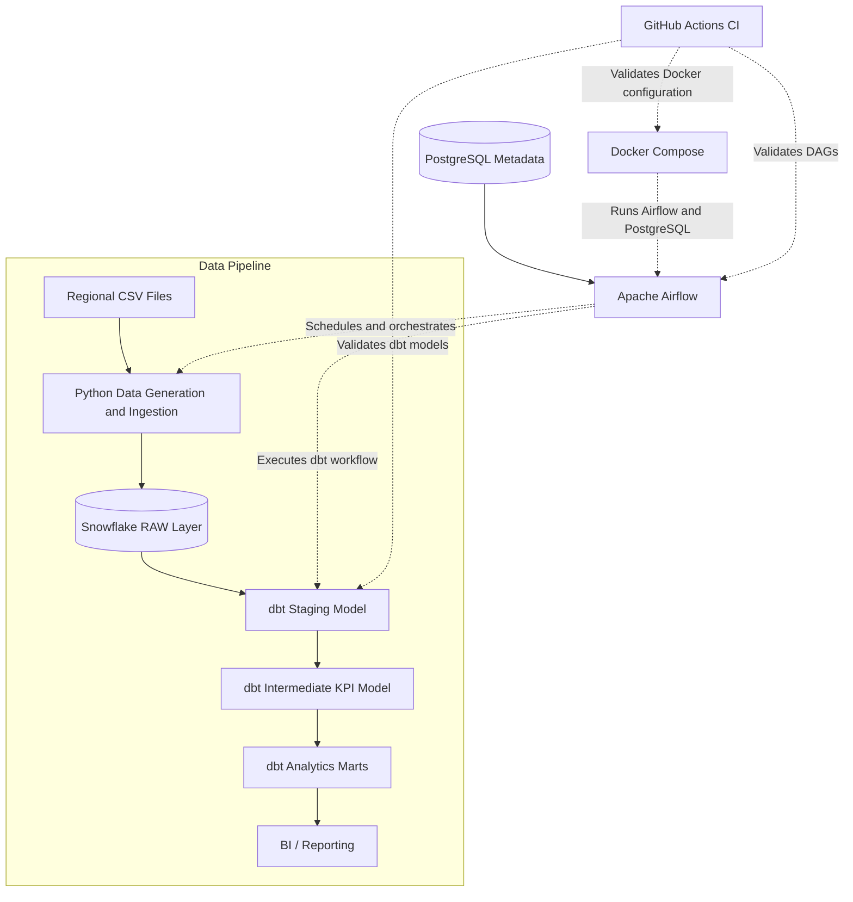

### Architecture Components

| Component | Responsibility |
|---|---|
| Python | Generates regional operational data and loads it into Snowflake |
| Snowflake | Stores raw operational data and transformed analytics models |
| dbt | Cleans data, calculates reusable KPIs, builds marts, runs tests, and generates lineage documentation |
| Apache Airflow | Schedules and orchestrates the complete pipeline |
| PostgreSQL | Stores Airflow metadata, task states, and execution history |
| Docker Compose | Runs the local Airflow and PostgreSQL environment consistently |
| GitHub Actions | Performs dbt, Airflow DAG, and Docker validation after every push |

---

# Technology Stack

| Layer | Technology |
|--------|------------|
| Programming | Python |
| Data Warehouse | Snowflake |
| Data Transformation | dbt Core |
| Workflow Orchestration | Apache Airflow |
| Containerization | Docker & Docker Compose |
| CI | GitHub Actions |
| Version Control | Git |
| Database | PostgreSQL (Airflow Metadata) |
| Data Processing | Pandas |
| Secrets & Configuration | GitHub Secrets & Environment Variables |

---

# Project Structure

```

airflow-dbt-snowflake-analytics-pipeline/
│
├── .github/
│   └── workflows/
│       ├── airflow_dag_check.yml
│       ├── dbt-ci.yml
│       └── docker_validation.yml
│
├── dags/
│   └── retail_analytics_pipeline_dag.py
│
├── data/
│   ├── raw/
│   │   ├── east_operations.csv
│   │   ├── north_operations.csv
│   │   ├── south_operations.csv
│   │   └── west_operations.csv
│   └── processed/
│
├── dbt_retail_pipeline/
│   ├── models/
│   │   ├── staging/
│   │   │   ├── sources.yml
│   │   │   ├── stg_operations.sql
│   │   │   └── schema.yml
│   │   ├── intermediate/
│   │   │   └── int_operations_kpis.sql
│   │   └── marts/
│   │       ├── mart_daily_trend.sql
│   │       ├── mart_region_performance.sql
│   │       └── mart_weekly_summary.sql
│   ├── macros/
│   ├── tests/
│   ├── dbt_project.yml
│   └── packages.yml
│
├── screenshots/
│
├── scripts/
│   ├── etl/
│   │   ├── generate_sample_data.py
│   │   └── load_to_snowflake.py
│   ├── snowflake_setup/
│   │   ├── 01_create_database.sql
│   │   ├── 02_create_schemas.sql
│   │   ├── 03_create_raw_table.sql
│   │   └── 04_create_roles.sql
│   └── sql_checks/
│       ├── check_dbt_models.sql
│       └── validate_snowflake_data.sql
│
├── Dockerfile
├── docker-compose.yaml
├── requirements.txt
├── .env.example
├── profiles.yml.example
├── .gitignore
└── README.md

```

# Pipeline Workflow

## Step 1 – Data Generation

Python automatically generates daily operational data for four business regions.

Each record contains realistic business metrics including:

- Regional information
- Customer inflow
- Retention
- Revenue
- Refunds
- Marketing costs
- Operational KPIs

The generated CSV files simulate the daily reports received from business teams.

---

## Step 2 – Load into Snowflake

### Snowflake Database

The generated operational data is loaded into the Snowflake **RAW** schema before being transformed by dbt.

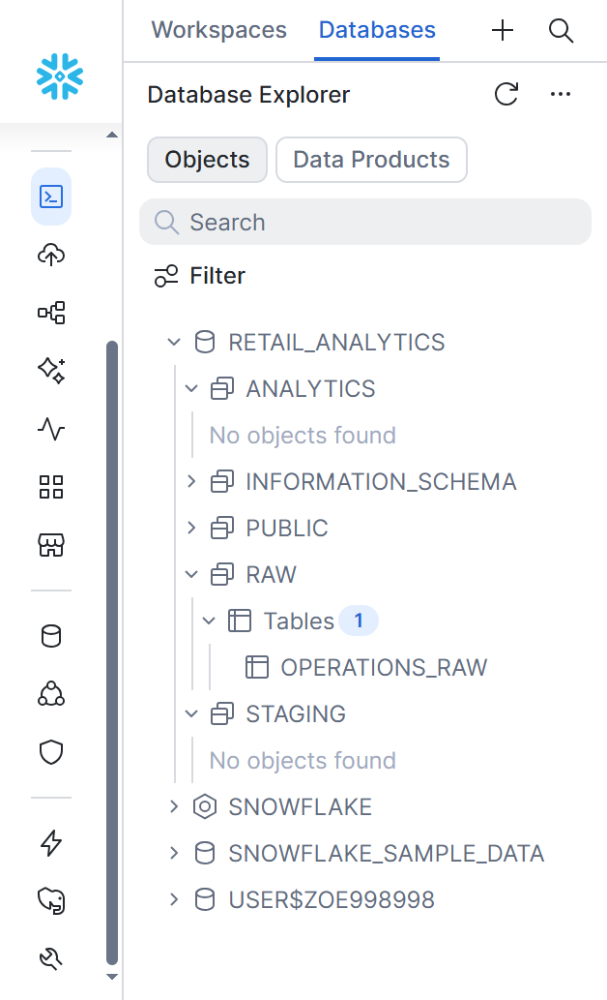

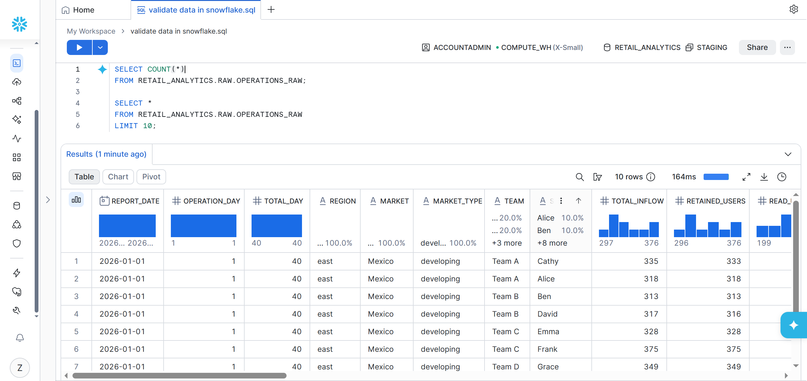

---

## Step 3 – Data Transformation with dbt

### dbt Models

The project follows a layered dbt architecture consisting of staging, intermediate and mart models.

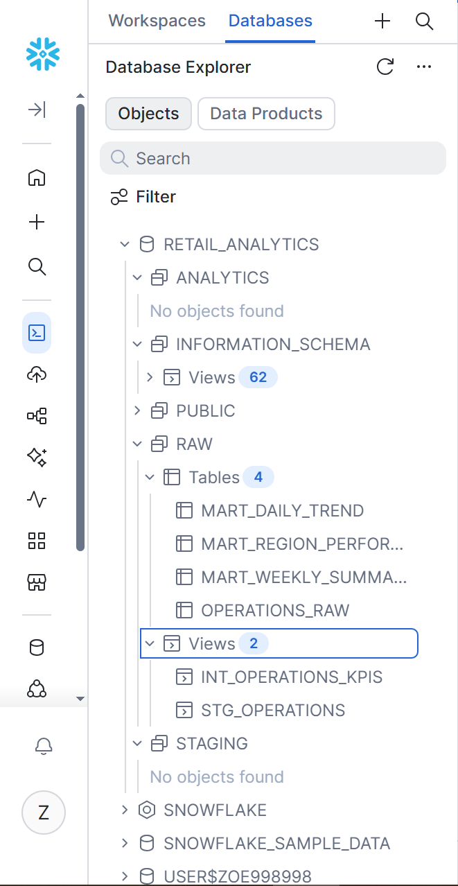

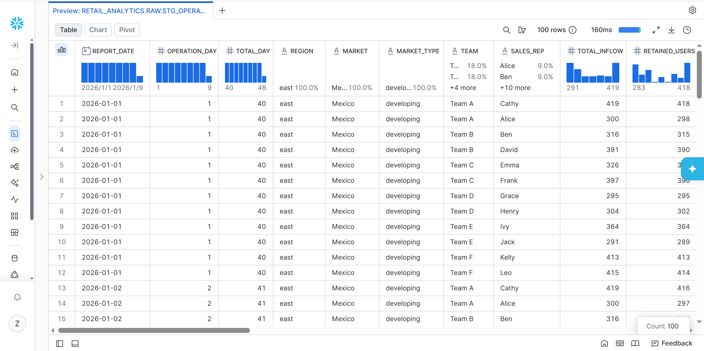

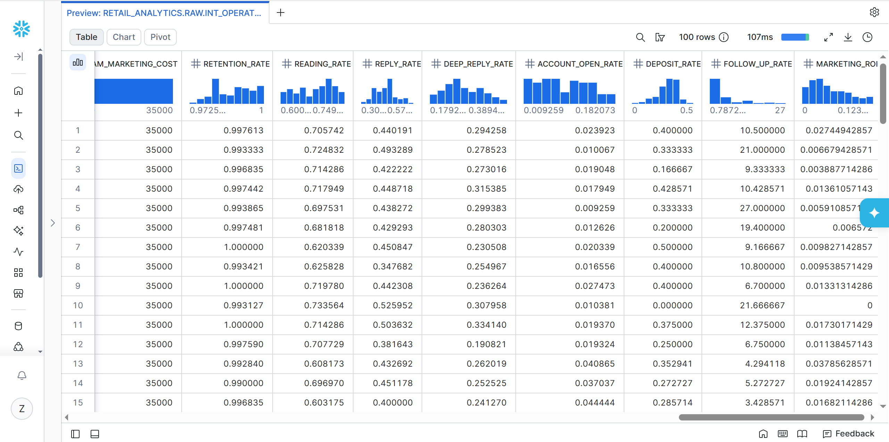

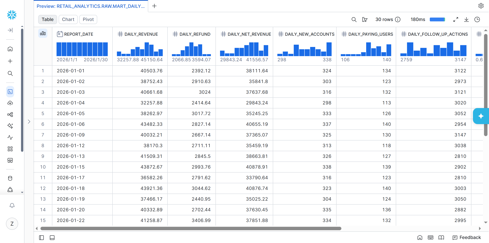

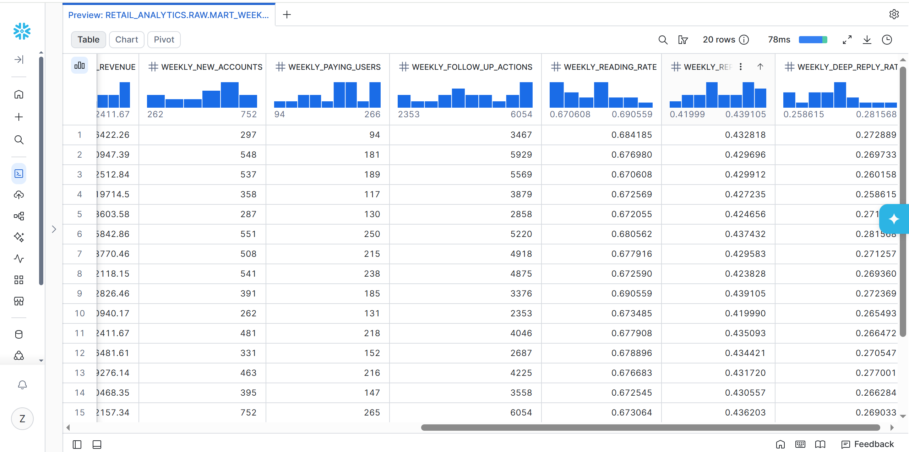

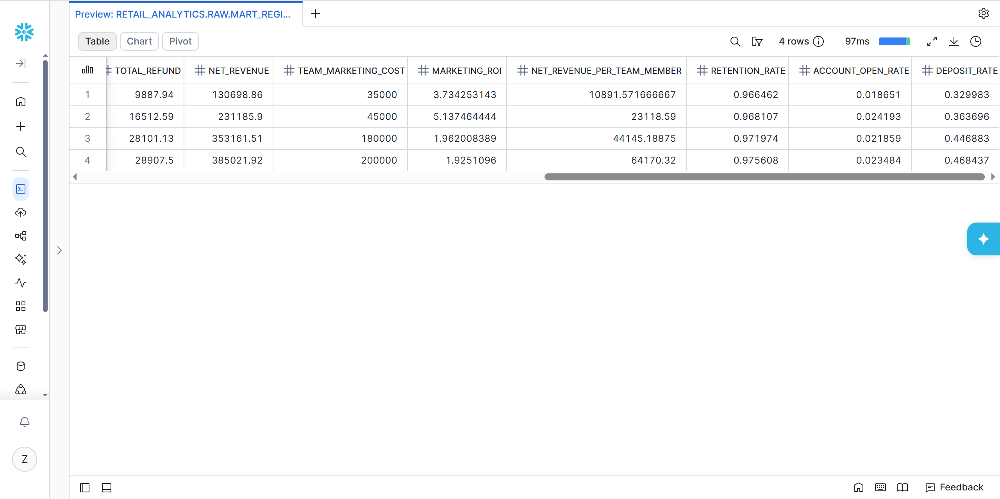

### dbt Lineage Documentation

The dbt project follows a layered transformation architecture:

- Raw source layer
- Staging models for cleaning and standardisation
- Intermediate models for KPI calculations
- Mart models for analytics consumption

The generated dbt documentation provides model lineage and dependency visualization.

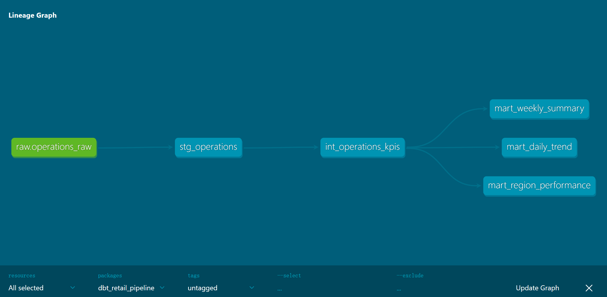

### Staging Layer

- Cleans raw data
- Standardizes column names
- Casts data types
- Removes inconsistencies

### Intermediate Layer

Calculates business KPIs including:

- Retention Rate
- Reading Rate
- Reply Rate
- Revenue Metrics

### Mart Layer

Produces final reporting tables ready for BI dashboards and analytics.

---

# Data Quality Testing

dbt tests ensure the reliability of the transformed data.

Implemented tests include:

- Not Null
- Accepted Values
- Expression Tests
- Business Logic Validation

Example validations:

- retention_rate must be between 0 and 1
- required business fields cannot be null
- market type must match expected values

This ensures downstream analytics always use validated datasets.

---

# Apache Airflow

Apache Airflow orchestrates the complete workflow.

Pipeline tasks include:

1. Generate daily data
2. Load data into Snowflake
3. Install dbt package dependencies
4. Execute dbt models
5. Run dbt tests

The DAG provides:

- task dependency management
- execution monitoring
- retry mechanisms
- execution history
- scheduling automation

## Airflow Workflow

The pipeline is automatically orchestrated by Apache Airflow.

### Scheduled DAG

The pipeline runs on a scheduled basis.

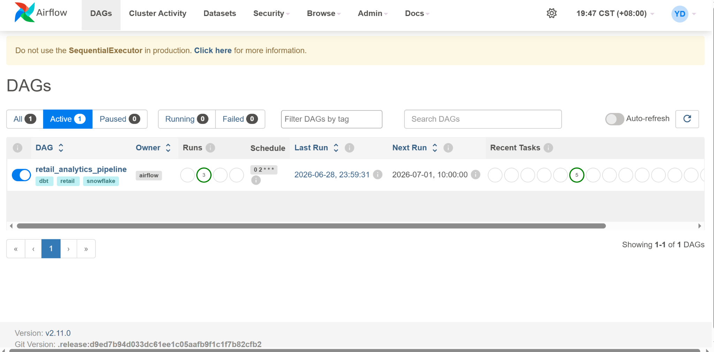

### DAG Dependency Graph

Each task executes in sequence once the previous task completes successfully.

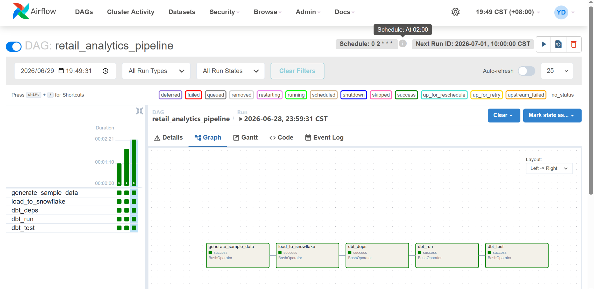

### DAG Run History

Airflow records the execution history for monitoring and troubleshooting.

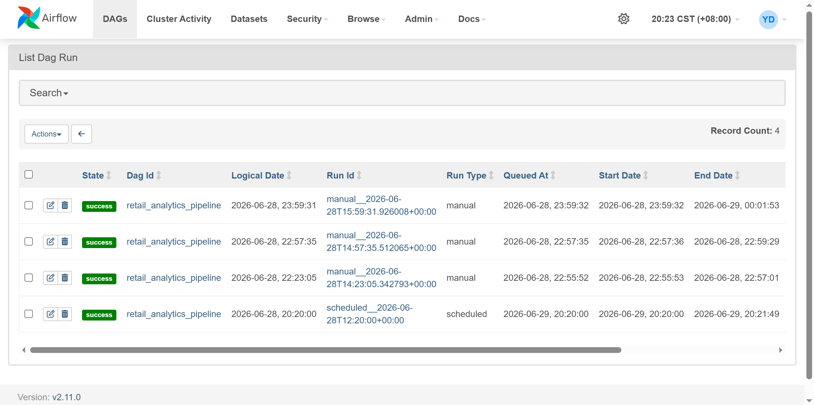

---

# Docker

The local orchestration environment runs inside Docker containers.

The local development environment exposes:

- Airflow Webserver: `localhost:8080`
- dbt Documentation Server: `localhost:8081`

These services run independently, allowing Airflow monitoring and dbt documentation browsing to be accessed separately.

Airflow provides workflow orchestration and monitoring, while dbt documentation provides interactive model documentation and lineage visualization.

Containerized services include:

- Apache Airflow
- PostgreSQL Metadata Database
- Scheduler
- Webserver
- Initialization Service

The Airflow environment is built from the official Apache Airflow Docker image with additional dbt and Snowflake dependencies installed.

Docker ensures consistent environments across development and deployment.

---

# Python Dependencies

The standalone Python and dbt dependencies are listed in `requirements.txt`.

They include:

- Pandas and NumPy for data processing
- Snowflake Connector for database connectivity
- dbt Core and the dbt Snowflake adapter for data transformation
- python-dotenv for local environment configuration

Airflow runtime dependencies are managed through the Docker image to maintain a consistent orchestration environment.

The GitHub Actions DAG-check workflow runs in a separate temporary environment. It installs the pinned Airflow version and only the additional packages required to import and validate the DAG.

For optional local development outside Docker, install the standalone dependencies with:

```bash
pip install -r requirements.txt
```

When running the project entirely through Docker, this manual installation is not required.

---

# Continuous Integration

GitHub Actions automatically validates every code change.

The CI pipeline performs:

- Python environment setup
- Snowflake connection setup
- Runtime configuration generation
- dbt parse
- dbt compile
- dbt documentation generation
- dbt build
- Docker Compose validation
- Airflow DAG validation

This automatically detects broken pipeline changes after every push to the main branch.

### GitHub Actions Workflow

Every push automatically validates the project.

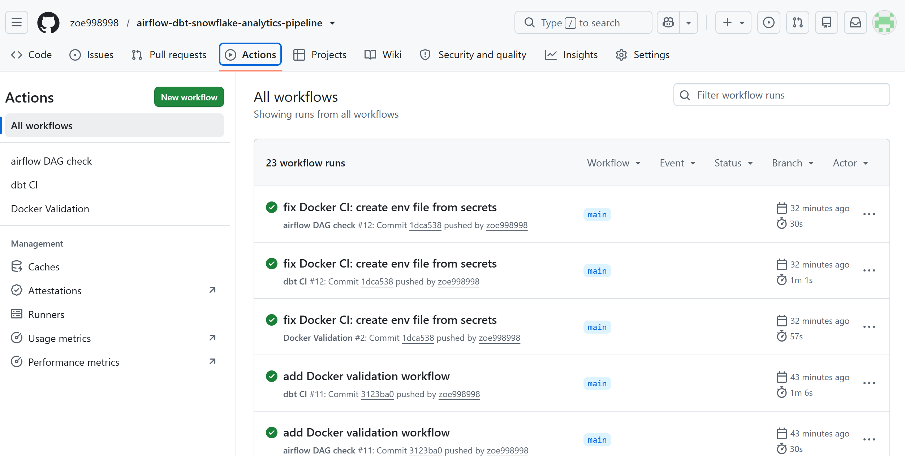
---

# Secret Management

The project uses:

- GitHub Secrets for securely storing credentials
- Runtime environment variables injected during CI workflows
- Automatically generated `.env` and `profiles.yml` configuration files during GitHub Actions execution

Sensitive credentials are never committed to the repository.

---

# Engineering Decisions

## Why Snowflake?

Snowflake provides a scalable cloud-native data warehouse that separates storage and compute, making it suitable for modern analytics workloads.

## Why dbt?

dbt enables modular SQL development, automated testing, documentation, and version-controlled data transformations.

## Why Airflow?

Airflow provides reliable workflow orchestration with scheduling, monitoring, retry mechanisms, and dependency management.

## Why Docker?

Docker creates reproducible development environments and simplifies deployment across different machines.

## Why GitHub Actions?

GitHub Actions automatically validates every commit, improving development quality and reducing deployment risk.

---

# Skills Demonstrated

This project demonstrates practical experience with:

- Data Engineering
- ETL Pipeline Development
- Data Warehouse Design
- SQL Data Modeling
- Cloud Data Warehousing
- Workflow Orchestration
- Containerization
- Continuous Integration
- Data Quality Testing
- Version Control
- Automation
- Python Development

---

# Future Improvements

Future enhancements may include:

- AWS S3 as the production data source
- Incremental dbt models
- Terraform infrastructure provisioning
- Great Expectations for advanced data quality validation
- Deployment to AWS EC2
- Automated cloud deployment pipeline

---

# Learning Outcomes

This project was designed to simulate a real-world modern Data Engineering workflow rather than focusing on isolated tools.

Through building this project, I gained hands-on experience with:

- designing layered data warehouse architectures
- orchestrating end-to-end ETL workflows
- implementing continuous integration for analytics engineering
- containerizing data platforms with Docker
- building maintainable dbt projects
- applying software engineering best practices to data pipelines

The result is a production-inspired analytics pipeline that demonstrates the core components of a modern Data Engineering workflow, from ingestion and transformation to orchestration, testing, and continuous integration.